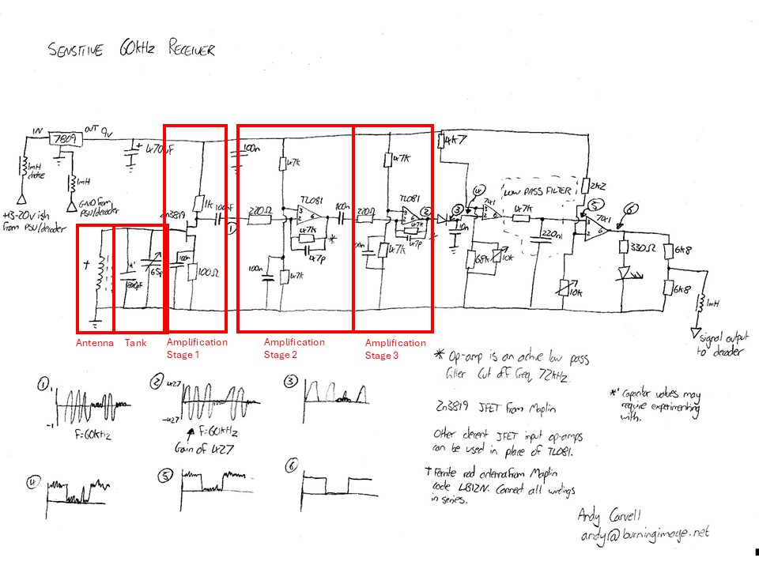

# My WWVB based NTP server
GPS is the de-facto standard for NTP reference clocks. Inexpensive GPS modules can easily be added to a Raspberry Pi in order to build an accurate reference clock for NTP. I have been wanting to do something a bit different and utilize an older technology to obtain accurate timing for an NTP server. I am going to use WWVB as a time source for an NTP reference clock. No, it's not as accurate as GPS. No, it's not practical. It's just for fun. And it turns out not to be as straighforward as I first imagined.

# WWVB
If you are not familiar with WWVB, it is an AM radio signal broadcast out of Fort Collins, Colorado, and is operated by the National Institute of Standards and Technology (NIST). See: https://www.nist.gov/pml/time-and-frequency-division/time-distribution/radio-station-wwvb

WWVB is commonly used in inexpensive radio-controlled clocks in the United States. The clock includes a small ferrite rod antenna and a chip to demodulate the AM signal and automatically set the time. I have owned a few of these over the years, and they work pretty well if you place them in a location that gets a good signal from the WWVB broadcast. In my experience, proper placement and orientation can be a fiddly process. These clocks typically attempt readio reception at night when the amount of RF interference is lowest and update their time once per day. They are not typically designed for continuous reception like I want in a time server.

# WWVB Modulation
### Amplitude modulation
WWVB uses a pulse width modulation scheme on the AM transmission to encode time data. Every minute, sixty one-second bits of data are encoded by reducing the amplituded of the carrier signal for a specific interval. 0.2s for a 0 bit, 0.5s for a 1 bit, and 0.8s for a framing marker. These sixty bits are used to encode the time and date into a one minute data frame that can be decoded by a simple receiver.

### Phase Modulation
Starting in 2012, WWVB added phase modulation to the signal in order to encode additional data on the 60KHz carrier. Binary phase shift keying (BPSK) is used to encode the time and date alongside the PWM data. Twice per hour, this BPSK modulation is used to send an extended six-minute data frame which can be used to provide a more robust and reliable method of detecting the potentially weak WWVB signal for any receiver circuits that are able to decode it.

# First attempt
My initial idea was to find a WWVB module that I could simply swap out for a GPS module on an existing Raspberry Pi based NTP server. Universal Solder in Canada sells a WWVB module that seemed to fit the bill, so I ordered one. 	[EverSet ES100 WWVB BPSK Atomic Clock Starter Kit](https://www.universal-solder.ca/product/everset-es100-wwvb-bpsk-atomic-clock-starter-kit/)

Physically connecting it to the Pi was pretty straightforward. It uses I2C to communicate and a couple other GPIO pins for IRQ and Enable. I used the code from [mahtin/es100-wwvb](https://github.com/mahtin/es100-wwvb) to get started. Everything worked, sort of. I was able to get successful time readings from the ES100, and mahtin's code even wrote to SHM so interfacing with NTP was dead simple. However, I quickly understood the limitations of this solution. 

 - I had hoped to get a new reading every minute from the ES100. However, there is a little processing time required, and getting a reading takes about a minute and 20 seconds. So, you're going to get time about every two minutes at best, as far as I can tell.
 - The ES100 has a "tracking" mode that completes a decode in around 30 seconds, so a once-per-minute update seemed feasible. I hacked on the python code for a while and was able to get time updates once a minute, except for the six-minute windows that contain the BPSK extended frames. But, the offset from GPS for those readings was different from the offset I got when decoding a full 60 second frame, and varied from one reading to the next by up to several hundred milliseconds.
 - The ES100 does not decode the 6-minute BPSK extended frames. So, you definitely won't get any readings for 12 minutes out of every hour.
 - I had also hoped to sync to the one second encoded bitstream to update NTP more frequently than once per minute. But, the ES100 does not expose the PWM or BPSK encoded bitstreams at all. You set the enable pin on your GPIO and wait a minute and a half, and maybe you will get the time. Maybe not.

I consider this first attempt to be a partial success, but the results were a bit underwhelming. I was getting time, but it varied by tens or hundreds of milliseconds from one reading to the next. It's certainly good enough for building a digital clock display that sets the time automatically. But, it is definitely not a time source you want to use for an NTP reference clock. For my purpose, I need direct access to the WWVB signal itself.

# Second Attempt
After experimenting with the ES100 and understanding its limitations, I set out to find a receiver that would give me access to the raw WWVB signal. Finding nothing ready-made, I realized I would have to build an RF front end and use an analog-to-digital-converter (ADC) to get direct access to the data stream. I found this fantastic [blog post](https://www.burningimage.net/clock/sensitive-60khz-receiver/) by Andy Carvell with a circuit diagram for a suitable RF front end, tuned specifically to receive a 60KHz WWVB signal. Designing and building electronic circuit from components is way outside my realm of expertise, but I found a breadboard and some assorted electronics parts on Amazon and started experimenting.

I was able to use an antenna from the ES100 kit to get started. The reference circuit from Andy's blog includes a capacative "tank" for tuning the antenna to 60KHz. The ES100 antenna has an integrated capacitor and is pre-tuned, so after fiddling with capacitors for a long while, I finally realized I could omit the tank from my breadboard prototype. 

### Stage 1
The first stage of amplification uses a JFET transistor (2N3819). The ratio of the two resistors (1K ohms/100 ohms) determines the amplification, in this case 10x. Further amplification will be done in stage 2 and stage 3 using op-amps. I started out just building the circuit with just the antenna, tank, and the JFET stage. My cheap handheld oscilliscope was all over the place with frequency readings often in the MHz range, and the trace looked to me very much like noise. I assumed that my antenna was not resonating at 60KHz and attempted to try differnt capacitor values in the tank, but to no avail. After a couple days of frustration, I probed the ground rail instead of the JFET output and realized that the readings were indistinguishable between the two. The reason that the output looked like noise is because that's exactly what it was! At 10x, the WWVB signal is still well below my scope's sensitivity. I couldn't tell whether the circuit was working at all. I purchased a LCR meter to start by measuring the antenna. That confirmed that the antenna was already resonant at 60KHz and I didn't need the tank capacitors. So why couldn't I see anything but noise from the first amplification stage? The op-amps finally arrived from Amazon, so I proceeded to add stages 2 & 3.

### Stage 2 & 3
I added the op-amp stages to the breadboard. After the first one, the scope showed a weak signal peaking up above the noise. With the second one installed, I coudl finally see a waveform on the scope. The scope measured a frequency around 80KHz, so I was still unsure about things. But it was a signal! Was it WWVB? I ended up making another Amazon purchase for a signal generator so I could generate a 60KHz test signal and make sure I was picking up the correct frequency. Sweeping back and forth between 50 and 70KHz confirmed that the amplitude of the signal was at its highest around 60.5KHz, and quickly dropped of at around 5KHz in either direction. The signal I was getting from the air must be WWVB. I think my scope doesn't report the correct frequency either because I don't know how to use it properly, or because of the phase modulation interrupting the waveform. If I freeze the scope, I can actually see the phase changes in the waveform, further confirming that I am receiving WWVB.

The blog post for the reference circuit mentions that each op-amp also acts as a low pass filter. This is determined by the combination of resistor and capacitor use for the feedback loop from the output of the op-amp back to its input. In this case, we have a 47Kohm resistor and a 47pF capacitor. The low-pass cutoff frequency is defined by the formula:  $f_c = \frac{1}{2\pi RC} = \frac{1}{2\pi \times 47{,}000 \times 47 \times 10^{-12}} \approx 72,048\text {kHz}$. The gain of the op-am is determined bythe ratio of the resistor on the feedback loop and the resistor on the input signal. In this case $\frac{47,000}{220} \approx 214$x.

### Remaining Stages
The rest of the reference circuit rectifies the A/C waveform and converts it to a nice square wave that can be used to decode the PWM time code. I started building the remaining stages, but got no signal past the diode. I ordered a few more diodes and tried them, but none seemed to do the trick. I may try building a precision rectifier from a couple more op-amps to finish ou tthe reference circuit, but I intend to decode both the PWM and BPSK data streams so taking the output of the op-amp stages and feeding them into an ADC makes more sense for my purpose than finishing the reference circuit's analog processing.

